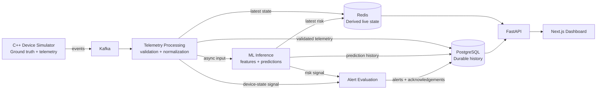

# Architecture and Design

Status: Phase 2 architecture baseline complete; detailed component design is the next phase. No application implementation is included or authorized by this document.

This document records logical responsibilities and system contracts. A logical component does not have to be an independently deployed service in the MVP. Details marked TBD are deferred to detailed component design or implementation unless they become an architectural dependency.

## Goals and Scope

The MVP provides fleet health monitoring and predictive maintenance for a simulated device fleet. It ingests telemetry asynchronously, retains history, computes anomaly and failure-risk signals, creates operational alerts, and presents fleet and device evidence to Reliability / Maintenance Engineers and Fleet / Operations Engineers.

The architecture prioritizes reproducible local development, durable history, clear ownership boundaries, traceable asynchronous processing, and a path to later cloud deployment. It does not require cloud infrastructure, production-scale guarantees, or independently deployed microservices for the initial implementation.

## Architecture Principles

### SOLID alignment
The architecture is intentionally shaped to align with SOLID principles, even before implementation begins:

- Single Responsibility: each logical component has one dominant responsibility (simulator, Kafka transport, telemetry processing, inference, alerting, API, frontend).
- Open/Closed: major contracts are defined around stable interfaces so future model or transport changes do not force broad structural rewrites.
- Liskov Substitution: service adapters and interfaces should be designed around stable contracts instead of hidden assumptions about concrete implementations.
- Interface Segregation: backend and frontend consume a narrow, purpose-fit API surface rather than a monolithic shared interface.
- Dependency Inversion: the application relies on abstractions for data access, model artifact selection, and event transport rather than hard-coding concrete implementations in core workflows.

These principles are being used as design constraints for Phase 3 and beyond, and they are explicitly reflected in the component separation and data ownership rules in this document.

### Scalability by design
The selected architecture is intentionally organized to scale with future growth:

- Kafka decouples producers and consumers so the telemetry pipeline can absorb higher event volume without forcing synchronous coupling.
- PostgreSQL is the durable system-of-record for history and metadata, allowing future index tuning, partitioning, and retention controls without changing the core product model.
- Redis is reserved for derived live state and cached operational views, keeping hot-path reads separate from durable history.
- Inference and alert evaluation are structured as distinct logical components so future scale-out decisions remain possible without redesigning the whole architecture.
- Data ownership is explicit, reducing dual-write or inconsistent-state risks as the fleet size grows.

The current implementation is local-first, but the architecture is designed for later horizontal scaling, additional device fleets, and higher telemetry throughput.

### Security by design
Security is planned from the start, even before the code layer exists:

- Authentication and authorization will be designed at the API boundary before production deployment.
- Secrets and credentials will not be embedded in source-controlled configuration.
- Transport security will be required for any deployment beyond local development.
- Data at rest and in transit will be planned with encryption requirements from the start.
- Operational services will treat telemetry, model outputs, and alert data as sensitive operational data and avoid exposing raw internal state beyond the required API surface.

A dedicated security and data-protection design is expected to follow this Phase 3 baseline before broader deployment.

## High-Level Architecture

Diagram shows logical flows, not mandated process or deployment boundaries. Internal wiring may evolve; asynchronous processing must remain decoupled from dashboard requests.

## Component Responsibilities

| Component | Responsibility |
| --- | --- |
| C++ Device Simulator | Device lifecycle, telemetry generation, hidden degradation, deterministic state transitions, failure occurrence, recovery, and fault injection; publishes telemetry/events. Owns ground truth. |
| Kafka | Asynchronous transport for telemetry and related events; decouples producers from consumers. It is not an application query database. |
| Telemetry Processing Service | Consumes telemetry, validates and normalizes it, persists historical telemetry, updates derived current state, and makes validated telemetry available to inference. |
| PostgreSQL | Durable source of truth for relational application state and historical records. |
| Redis | Low-latency derived operational state and cache. Its contents can be rebuilt from durable/event data where practical. |
| ML Training Pipeline | Offline dataset preparation, feature/label generation, training, evaluation, comparison, and versioned artifact creation. |
| ML Inference Service | Online rolling feature windows, anomaly detection, failure prediction, prediction persistence, and latest risk-state updates. Does not train models in the online path. |
| Alert Evaluation | Applies operational policy to deterministic state transitions and ML risk signals; persists alert lifecycle changes. It is logically separate from ML and may initially share a deployable process with another component. |
| FastAPI Backend | Validates frontend requests, composes current and historical views from Redis/PostgreSQL, exposes operational APIs, and handles alert acknowledgement. |
| Next.js Frontend | Presents fleet, device, prediction, telemetry, and alert information and supports alert acknowledgement. Never connects directly to infrastructure stores or Kafka. |

## Data Flow

1. The simulator emits telemetry and lifecycle/fault events to Kafka.
2. Telemetry Processing consumes events, validates and normalizes telemetry, persists historical records to PostgreSQL, and updates current derived state in Redis.
3. Validated telemetry is delivered asynchronously to ML Inference. Exact wiring (for example, a Kafka event versus another internal handoff) remains a detailed design decision.
4. Inference constructs the observation window, runs anomaly detection and supervised prediction, stores prediction history in PostgreSQL, and updates latest operational risk in Redis.
5. Alert Evaluation considers simulator-confirmed state changes and ML risk signals, then persists alert state in PostgreSQL.
6. FastAPI composes current views from Redis and historical views from PostgreSQL. The frontend reads precomputed predictions; a user request never synchronously triggers inference.

Preserve identifiers sufficient to trace device → telemetry event → processed telemetry → prediction → alert. Exact event schemas, topic names, idempotency strategy, and transaction/offset coordination remain TBD during detailed component design.

## Data Ownership and Storage

| Data | Owner / source of truth | Operational use |
| --- | --- | --- |
| Device and lifecycle metadata | PostgreSQL | Durable registration and metadata reads |
| Firmware/device configuration metadata | PostgreSQL | Durable configuration and history |
| Historical telemetry | PostgreSQL | Investigation, training, and evaluation |
| Prediction history | PostgreSQL | Durable prediction records and evaluation |
| Alert history and acknowledgement state | PostgreSQL | Durable operational workflow and audit |
| Relevant lifecycle events | PostgreSQL where historical investigation/reproducibility requires them; simulator remains the origin of truth | Investigation and training labels |
| Latest/current device state | Redis, derived from simulator events | Low-latency dashboard reads; reconstructable where practical |
| Latest failure risk/prediction | Redis, derived from inference output | Low-latency dashboard reads |
| Fleet summary counters | Redis, derived cache | Fast fleet overview |
| Events in transit | Kafka | Asynchronous transport and consumer decoupling |
| Hidden simulator degradation and true failure occurrence | Simulator | Ground truth and offline label/evaluation source; not an inference feature |
| Model artifacts | Versioned artifact storage | Selected artifact loaded by inference |
| Active model metadata | PostgreSQL or a model-registry abstraction | Identifies the explicitly selected inference model |

PostgreSQL owns durable application history; Redis owns derived live operational state; Kafka transports events; the simulator owns ground truth. Redis loss may reduce current-state performance but must not destroy durable history. Anything needed for investigation, audit, training, or reproducibility is durable. Cache contents, current summaries, and temporary rolling feature state may be derived or ephemeral.

Exact PostgreSQL schema/indexes, Redis keys/TTLs/invalidation and rebuild details, Kafka topic/retention/partition settings, artifact storage implementation, and data-retention durations are TBD during detailed component design / implementation.

## Telemetry Contract

The previously agreed MVP telemetry factors remain the contract; this architecture does not redefine them. Required fields are `device_id`, `timestamp`, `firmware_version`, `temperature`, `power_draw`, `cpu_utilization`, `memory_utilization`, `timing_jitter`, `error_count`, and `device_state`. `actuator_load` and `position_error` are conditionally required for devices with actuator behavior. `battery_voltage`, `battery_current`, sensor-specific readings, `fault_code`, and additional device-specific metrics are optional.

For the detailed Phase 3 event and database schema draft, see [docs/telemetry-schema.md](telemetry-schema.md). This file remains intentionally high-level; the schema document captures the event contract and the initial durable table layout for the MVP.

Additional Phase 3 design references: [docs/security-scalability.md](security-scalability.md).

The default MVP interval is one event per device every 5 simulated seconds. Normal events include required fields unless unavailable or invalid. Event timestamps represent UTC event time serialized as ISO 8601, are monotonically non-decreasing per device, and remain internally consistent when simulation runs faster than wall-clock time. Ingestion time may be recorded separately.

Missing values are not silently replaced with zero. Missing required fields fail event validation and enter error handling; optional fields may be absent. Malformed or impossible values do not enter normal processing: validation failures are logged, routed to an error/dead-letter path, and counted for observability. ML feature generation must handle missing telemetry consistently between training and inference. The imputation/forward-fill/interpolation policy, exact units, valid ranges, and calibration rules remain TBD during detailed data/ML design.

`device_state` is simulator ground truth and may be stored for labels/evaluation, but must not be an ML input feature for failure prediction. Hidden degradation variables and future failure information are also excluded from inference inputs.

## Simulator and Device Lifecycle

The simulator owns device lifecycle, observable telemetry generation, hidden degradation progression, deterministic state transitions, true failure occurrence, recovery, fault injection, and reset/restart behavior.

States are HEALTHY, WARNING, CRITICAL, and FAILED. Allowed transitions are:

- HEALTHY ↔ WARNING
- WARNING ↔ CRITICAL
- CRITICAL → FAILED

WARNING may recover to HEALTHY when the degrading condition clears and remains stable. CRITICAL may recover to WARNING when severe degradation clears before failure; it cannot recover directly to HEALTHY. FAILED is terminal for the current simulated run. Recovery from FAILED requires an explicit reset, restart, or replacement that begins a new device lifecycle/run.

Only deterministic simulator conditions change ground-truth state. ML risk, anomaly scores, and predictions can affect alerts, never simulator state. Exact degradation equations, thresholds, recovery durations, and reset semantics remain TBD during detailed simulator design.

## ML Architecture and Contract

### Training and Inference

Offline ML Training owns historical dataset preparation, feature engineering for training, label generation from simulator future-failure events, train/validation/test preparation, model training/evaluation/comparison, and versioned artifact generation. Candidate supervised models are Logistic Regression (baseline), Random Forest, and XGBoost; the MVP selects based on measured validation performance, not an advance assumption. Isolation Forest provides a separate anomaly signal.

Online ML Inference owns rolling feature-window construction, loading the explicitly selected versioned model, anomaly detection, failure prediction, prediction persistence, and current operational risk updates. It is asynchronous and is never invoked synchronously by a frontend request. Anomaly output and supervised failure probability remain distinct signals.

Model artifacts are versioned and associated with model type, version identifier, training timestamp, feature schema/version, evaluation metrics, and artifact location. Early local development uses a simple versioned local artifact location behind an abstraction that can later support S3 or MLflow. Active model metadata is stored in PostgreSQL or a registry abstraction. Drift monitoring, automated retraining, and advanced registry workflows are post-MVP; MLflow may be added later but is not required initially.

### Prediction Problem

Primary supervised question: “Will this currently operating device enter FAILED within the next 30 minutes of simulated time?” The model uses the previous 5 minutes of observable telemetry; this observation window is distinct from the 30-minute future prediction horizon. The label is 1 if the simulator records entry into FAILED within that horizon, otherwise 0. Simulator ground truth supports labels and evaluation and never defines model inference inputs or model output truth.

Ten- and 60-minute horizons are comparison-only. Primary evaluation includes precision, recall, F1, PR-AUC, and false-positive rate; ROC-AUC and inference latency are secondary. These are evaluation criteria, not claims of achieved performance. Exact feature definitions, missing-data strategy, serialization format, artifact layout, promotion process, training cadence, and hyperparameters remain TBD during detailed ML design.

## Alerting

Alert Evaluation is a logical component separate from the ML model. It interprets deterministic simulator/device-state conditions, anomaly signals, failure probabilities, and existing alert state. ML supplies risk information; the alert evaluator makes the operational decision; the simulator remains the ground-truth owner. The evaluator may initially share a process with telemetry processing or inference; a separate deployment is not required without a demonstrated need.

MVP alert sources include both deterministic simulator/device-state conditions and ML-generated risk signals. Levels are WARNING (early degradation, abnormal behavior, anomaly, or moderate risk), CRITICAL (severe degradation, high imminent-failure risk, or multiple concerning signals), and FAILURE (simulator-confirmed FAILED state). ML probability must never establish FAILURE ground truth.

Lifecycle is ACTIVE → ACKNOWLEDGED → RESOLVED. A user acknowledgement records that an engineer reviewed the alert and accepted it for investigation. RESOLVED means the underlying condition cleared or appropriate reset/restart/replacement occurred. Alert records and acknowledgement state are durable in PostgreSQL. Basic acknowledgement is in MVP; assignment, escalation, email/SMS, PagerDuty, ticketing, and advanced maintenance workflows are out of scope.

Exact alert rules, warning/critical and probability thresholds, signal combinations, cooldown/debounce, notification integrations, and detailed reactivation semantics remain TBD during alert component design.

## API and Dashboard

FastAPI is the only frontend-facing application interface. The frontend must not directly access PostgreSQL, Redis, or Kafka. The backend composes operational state from Redis and durable history from PostgreSQL, validates requests, provides consistent responses, and handles acknowledgement.

Logical MVP API capabilities (names may change during detailed API design):

| Capability | Logical route |
| --- | --- |
| Fleet summary | `GET /fleet/summary` |
| Device list and detail | `GET /devices`, `GET /devices/{id}` |
| Device telemetry and predictions | `GET /devices/{id}/telemetry`, `GET /devices/{id}/predictions` |
| Device alerts and alert list/detail | `GET /devices/{id}/alerts`, `GET /alerts`, `GET /alerts/{id}` |
| Acknowledge alert | `POST /alerts/{id}/acknowledge` |

Required MVP screens:

- Fleet Dashboard: total devices; healthy, warning, critical, and failed counts; active alerts; highest-risk devices; recent failures; fleet health overview. Users inspect fleet status, identify unhealthy devices, and select one to investigate.
- Device Detail: metadata, current state and risk, latest telemetry, historical telemetry charts, anomaly result/score, failure probability, prediction history, and alert history. Users inspect behavior and prediction evidence.
- Alerts: active alerts, severity, affected device, creation time, status, and acknowledgement state. Users can acknowledge an alert.

The MVP targets reliability investigation with a high-level fleet overview. Model administration, advanced maintenance scheduling, BI/Power BI, assignment, and escalation are out of scope. Exact routes/schemas, pagination, authentication/authorization, API versioning/error format, page layout, filtering, charts, and responsive details remain TBD during component design.

## Deployment and Environments

The MVP is local-first and cloud-ready. Reproducible local development is the priority; the eventual full local stack should run with Docker Compose and include the simulator, Kafka, telemetry processing, ML inference, PostgreSQL, Redis, FastAPI, and Next.js. Logical boundaries should not require independently deployed services locally.

Cloud deployment is a later milestone. The architecture should avoid assumptions that block Kubernetes/AWS. Future candidates include EKS, ECR, RDS PostgreSQL, S3, CloudWatch, IAM, VPC, optional MSK and ElastiCache, Terraform, Kubernetes, and Helm where useful. No cloud service topology is selected here.

Exact AWS architecture, EKS/MSK choices, networking, Terraform modules, load balancing, secrets strategy, service sizing, replica counts, and autoscaling are deferred to deployment design. Authentication and authorization are required by the requirements, but their MVP mechanism remains an explicit security-design question.

## Observability, Scale, and Resilience

Long-running services expose structured logs, liveness/health checks, readiness checks, metrics, and identifiers sufficient for end-to-end traceability.

MVP operational metrics include telemetry received/processed/malformed/rejected and processing errors; Kafka consumer lag and processing failures; inference count/failures/latency and active model version; API request count/latency/error rate; Redis hit/miss behavior and observable connection failures; active alert count and alerts created/acknowledged. Exact metric names, tracing framework, Grafana dashboards, and infrastructure alert thresholds remain TBD.

Design targets, not measured benchmarks:

- Initial simulated fleet: approximately 1,000 devices.
- Default event interval: every 5 simulated seconds per device, approximately 200 telemetry events/second at nominal steady state.
- Current-state dashboard/API reads should feel responsive; sub-second current-state reads are a target, not a verified SLA.
- Inference should keep pace without sustained backlog; telemetry processing should keep pace with the MVP target volume.
- Restart/loss of API, inference, telemetry consumer, or Redis must not corrupt durable history. Redis loss may temporarily reduce current-state performance but must not destroy durable information.

Exact API SLA, maximum throughput, tested fleet size, benchmark method, resource sizing, backpressure limits, and recovery-time objectives remain TBD and must be validated rather than presented as measured outcomes. Kafka durability/replay, database transaction/offset coordination, idempotency, and Redis reconstruction details require component design so the restart expectations are implementable.

## Retention and Data Lifecycle

MVP retains telemetry, prediction, and alert history long enough to support training, debugging, device investigation, prediction evaluation, alert investigation, and demonstration. Do not implement complex production archival policies in the MVP. The future architecture should allow configurable retention, aggregation/downsampling, object-storage archival, deletion policies, and cold storage. Exact durations, tiers, and archive schedules remain TBD.

## Decisions Deferred to Component Design / Implementation

Unless needed to resolve an architectural dependency, defer:

- Exact telemetry units, valid ranges, calibration, and missing-data/imputation rules.
- Exact simulator equations, thresholds, recovery durations, and fault-injection mechanics.
- Exact ML feature definitions, hyperparameters, serialization, and artifact implementation.
- Exact alert thresholds, combinations, debounce/cooldown, and reactivation rules.
- PostgreSQL schema/indexes/partitioning; Redis keys/TTLs/invalidation; Kafka topics/partitions/retention.
- Retry counts, timeouts, detailed payloads, pagination, API error schemas, and authentication implementation.
- Kubernetes/AWS topology, Terraform layout, sizing, replicas, autoscaling, networking, and secrets mechanism.
- Dashboard layout, chart library, filters, and responsive behavior.
- Exact retention duration, detailed benchmark method, and numerical production SLAs.

These details are TBD during detailed component design / implementation, not implicit decisions.

## Phase 2 Status and Remaining Questions

The Phase 2 criteria are met at the logical architecture level: major components and responsibilities, telemetry path, data ownership, sync/async communication, simulator ground truth and recovery, training/inference boundary, alert ownership, dashboard/API scope, local-first deployment direction, observability, scale targets, retention direction, and deferred details are documented.

No material contradiction remains in the architecture baseline. The logical flow from validated telemetry to inference is intentionally not tied to a final transport; Redis is derived operational state, not durable history; simulator state and ML risk are explicitly separate; the 200 events/second and sub-second reads are targets, not benchmark claims. Detailed design must resolve the durability/replay/idempotency mechanics needed to meet restart expectations, plus the remaining security and component-level TBDs above.

Phase 2 is sufficiently complete to begin detailed component design. This status does not authorize application implementation; implementation remains out of scope until explicitly approved.
